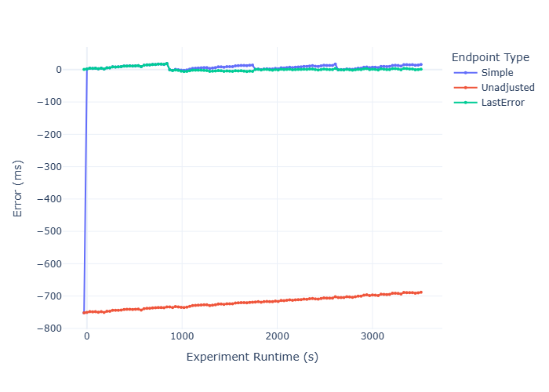

# NTPContinuousSync TODO: change name

## Contents

TODO: fill this out

## About

This repository contains a clock that is continually corrected using Network Time Protocol (NTP) synchronizations, making it accurate to roughly 1 millisecond depending on configuration. In contrast, the typical system clock can be off by up to a full second. The base features are implemented fully in python so that deployment is easy on any machine. Speed optimizations are implemented in C++, which may require more configuration depending on OS.


## Quick Start Guide

First, initialize an instance of the `QuickStart` class:
```python
example_endpoint = pysync.QuickStart()
```
To the current adjusted time in seconds since epoch (January 1, 1970, 00:00:00 UTC), call the `now` method:
```python
current_time = example_endpoint.now()
```

## Edit Mode

TODO: fill out


## Intended Use Case

The original purpose of this project is to track latency on timestamped websocket messages. This is especially important for cases where the information in the message determines a transaction taking place.

For example, let's say you wanted to buy an asset only when its price dips below a certain value, and you found a websocket with predictive power for this asset (in practice, this could be a related asset price that you are running through a classifier in real time). So when our websocket message comes in as `True`, we know that in a window of 80-100ms from now, the price will drop below our buying threshold. If the message is `False`, the price will not drop and we therefore should not buy.

First we should look at the simplest approach to this problem, which is to ping the server. We send a message to the server hosting the websocket and wait for a return message. The round trip time that we measure is our ping, so we take half of that for our one-way trip time. For this example, our ping is 40ms, so our one-way time is 20ms. Whenever we get a `True` message, we time our trade for the middle of the 80-100ms window, right at 90ms. Since it takes 20ms for the websocket message to reach us and 20ms for our `BUY` message to reach the server, we subtract our ping from the window time (90 - 40 = **50ms**) to get our waiting time. Let's do some trading:
```
WS Message 1: False
Response: Price will be high in 80-100ms, Do Nothing

WS Message 2: True
Response: Price will be LOW in 80-100ms, Wait 50ms and send a BUY message
    
WS Message 3: False
Response: Price will be high in 80-100ms, Do Nothing
```
So we sent our `BUY` message to arrive exactly 90ms after our predictive websocket told us `True`, meaning we bought the asset when it was cheap... right? Well, not really. This only works if each message has a latency of roughly half of our ping. Let's look at the exact same trading scenario, now with more information about latency that we did not know before:
```
Scenario Start: 0ms

WS Message 1: False
    Timestamp:              0ms
    Arrived:                24ms (slightly more latency)
    Assumed Creation Time:  24ms - ping/2 = 4ms
Response: Price will be high in 80-100ms, Do Nothing

WS Message 2: True
    Timestamp:              50ms
    Arrived:                110ms (significant lag spike)
    Assumed Creation Time:  110ms - ping/2 = 90ms
Response: Price will be LOW in 80-100ms, Wait 50ms and send a BUY message
    Optimal Arrival Time:   50ms creation + 20ms network delay + 50ms wait + 20ms network delay = 140ms
    Actual Arrival Time:    90ms creation + 20ms network delay + 50ms wait + 20ms network delay = 180ms
    
WS Message 1: False
    Timestamp:              0ms
    Arrived:                318ms (slightly less latency)
    Assumed Creation Time:  318ms - ping/2 = 298ms
Response: Price will be high in 80-100ms, Do Nothing
```
In reality, network latency can vary wildly, and, even if we are pinging the server once every few milliseconds to repeatedly check our latency, a lag spike in the server itself can cause the messages to be outdated even if the network is fine. As we can see above, we actually missed the window to send our `BUY` message because a lag spike caused 40ms more latency that we assumed we would have.

The moral of the story is that it is quite important to know what the latency is for each message when you are trading. When you go online and see people saying that they used Claude to make a polymarket trading bot that lost them a ton of money, this is why. They backtest assuming that their latency will either be zero or always equal to their ping. When you see Claude bots that *aren't* losing money, that's because they don't actually exist and are fabricated by either Anthropic's marketing department or a scammer trying to sell courses. But I digress.

The obvious solution here is to take the timestamp on each message (provided by the server hosting the websocket, not the timestamp of arrival on our machine) and compare it to the system time on our machine immediately as it arrives. This works beautifully, with one caveat: the system time on the average consumer motherboard can be off by up to a full second. 

There are a handful of reasons for this. Much like a pendulum in a grandfather clock, electronics have their own oscillators in the form of tiny quartz crystals that vibrate at a specific natural frequency. As these crystals change in temperature or age, their natural frequency also changes, leading to errors in timekeeping. There are ways around this - more expensive quarts watches have thermocompensated clocks, for example, which can lose as little as one second per year. The bottom line for a personal computer, however, is that these implementations simply are not worth the price. 

Instead of having a super precise clock, PCs just use something called Network Time Protocol (NTP) to reach out to a server with a more expensive, more precise clock to synchronize with on a regular basis. This happens once every few days or hours on most systems. `Pysync`, which is intended to have +/- 1ms accuracy at all times, synchronizes once every 5 minutes in default configuration.

If you're thinking that this is a very simple solution, you are correct. There are a few tricks to getting it to work efficiently and reliably, though, which are detailed in the [How It Works](#how-it-works) section of this writeup.


### Other Use Cases

TODO: fill out

## How It Works

Python's `ntplib` module allows for a user to query an NTP server for an `offset`, which is the error of the local machine's system time, formatted in such a way that it gives the correct time when added to the system time. So, to print the `offset`, for example:
```python
client = ntplib.NTPClient()
response = client.request('pool.ntp.org', version=3)
print(f'Offset (seconds): {response.offset}')
```
The purpose of `pysync`'s `NTPUpdater` class is to provide `offset`s on a scheduled interval (once every 5 minutes by default). In a fashion similar to the code snippet above, the `NTPUpdater` queries several NTP servers. Since the calculation for `offset` assumes symmetric latency and actual network pathways are typically slightly asymmetric, the `offset` from the server with the lowest latency is also the most accurate. This is what `NTPUpdater` keeps.

The most obvious way to use the `offset` is to simply add it to the system time whenever we call a function:
```python
def now():
    current_time = time.time()
    offset = response.offset
    return current_time + offset
```
Heres the issue: The system time is also undergoing NTP synchronization on a regular basis (usually once every few days or hours). If the system synchronizes and the system time experiences a large, discontinuous jump, then our `now` function's calculation will be wildly incorrect until it gets a new `offset`.

You could imagine this would be a problem even if you *weren't* using corrected time. If you were timing the duration of a race, for example. You could start your stopwatch at 0s, end it 10s later, and then look at your data to find that an NTP sync caused your stopwatch to go backwards 2s mid-race, making your measured time 8s instead of 10s.

The solution to this problem is already built in to every modern OS in the form of a monotonic clock. In python it is called `perf_counter` and in C++ it is referred to as `std::chrono::steady_clock`, and while they have slight differences, they both serve the same purpose: monotonic clocks can never go backwards, making them perfect for timing things. 

### Anchors in Time

To make use of our monotonic clock, `pysync` has the `OffsetAnchor` class. This class contains the following:

1. `offset`: time error in seconds from NTP sync
2. `time_ref`: a system time, taken at the same time as `offset`
3. `perf_ref`: a monotonic time, taken at the same time as `time_ref`

In order to get the corrected time at any point in the future, we follow the following formula:
```python
corrected_time = time_ref + (time.perf_counter() - perf_ref) + offset
```
where `time.perf_counter()` is the monotonic time taken whenever the calculation is invoked. Since we only rely on system time (`time_ref`) from the moment the NTP sync happens, it doesn't matter if it jumps discontinuously while we are keeping time. We rely solely on the monotonic clock to tell us how much time as passed since `time_ref` was taken, and then add that to `time_ref` to get the current adjusted time.

#### Simultaneous Referencing

Let's say we're trying to get our `time_ref` and `perf_ref` variables for our anchor. One may be temped to write:
```python
time_ref = time.time()
perf_ref = time.perf_counter()
```
The problem may already be obvious. These references are taken one after the other, not at the same time. This has the potential to introduce slight errors in our calculation. If we were running *only* `pysync` on our computer, this error would always be negligible (less than 100ns) because the lines of code are executed directly after one another. However, in a system that is under heavy load, the OS scheduler is perfectly capable of placing an unrelated task between these two lines, making them drift apart. While this is unlikely, it *is* possible, and since the solution is fairly simple, there is no reason not to implement it.

First, we sandwich `time_ref` between two monotonic references. Note that we switched to nanoseconds - this is simply for the sake of making this as precise as possible.
```python
p1 = time.perf_counter_ns()
time_ref = time.time_ns()
p2 = time.perf_counter_ns()
```
Now, in order to get `perf_ref`, we take the average of `p1` and `p2`. In addition, we can use these values to calculate our maximum error. Since the worst case scenario is that `p1` and `time_ref` are taken at the exact same time and `p2` is taken `p2-p1` nanoseconds later, this would place `time_ref` and `perf_ref` exactly `(p2-p1)/2` seconds apart. Our maximum error from this process is therefore +/- `(p2-p1)/2` nanoseconds.

Since we are interested in making error as low as possible, we can take multiple sets of time references and use the set with the minimum `p2-p1` window. This can easily be done using a `for` loop. Here are the results of a real implementation, taken directly from `pysync`'s `OffsetAnchor` class:

Iteration | p2-p1 (nanoseconds)
:---: | :---:
1| 900
2 | 300
3 | 100
4 | 100
5 | 100
6 | 100
7 | 100
8 | 100
9 | 100
10 | 100

An interesting behavior here is that the window only decreases in time, as opposed to resembling a random distribution. This is because as the loop progresses, the instructions and method references become cached in the CPU, eliminating overhead. It is also worth noting that we only get increments of 100ns. This is Windows OS at work, as its `QueryPerformanceCounter` ticks once every 100ns. For the C++ implementations of this same set of instructions, the window gets as low as 0 nanoseconds. In reality, of course, this just means that the instructions were completed in a time shorter than 100ns. If you wanted to keep track of maximum error, you would want to add 100ns to whatever value is reported to make up for this limitation. Since this is orders of magnitude smaller than the +/- 1ms precision I am looking for, however, I'm just ignoring it for now.

I've tested this same `for` loop on a few different machines, and 10 iterations were always more than enough to reach convergence. Of course, you can experiment with this on your own, or write a function that finds an optimal amount of iterations automatically.

#### Drift Verification & Tolerance

We've ensured that `time_ref` and `perf_ref` are acquired at roughly the same time, but what about `offset`? I mentioned earlier that it needs to be acquired at the same time as the references, but this isn't strictly true. It just needs to be the correct `offset` for the corresponding `time_ref`. If we got an `offset` from an NTP server and coincidentally had a system-wide NTP sync happen right before getting `time_ref`, we would have the wrong `offset`. Similarly, since we query multiple NTP servers for the one with the lowest ping, its possible that a well-timed system-wide NTP sync could cause some of the `offset`s to be for one `time_ref` and the remainder to be for a different `time_ref`.

The solution to this problem is to verify that the system clock has not drifted since before and after the NTP servers were queried and the `OffsetAnchor` was created. Since our `NTPUpdater` class does all of this in a single method called `get_best_offset`, all we need to do is wrap that method in a decorator called `verify_drift` that ensures no system-wide NTP syncs happened throughout the duration of the call, and re-calls the method if a syc *did* happen.

The implementation of `verify_drift` initializes a `TimeAnchor` class (exactly like `OffsetAnchor`, just with no `offset`) before and after the wrapped function is called. Since our anchors each have their own `time_ref` and `perf_ref`, we can make the following comparison:
```python
time_ref_delta = abs(anchor1.time_ref - anchor2.time_ref)
perf_ref_delta = abs(anchor1.perf_ref - anchor2.perf_ref)

has_drifted = abs(time_ref_delta - perf_ref_delta) > tolerance
```
Where `tolerance` is a small number that allows for floating point imprecision and error in reference acquisition. This is implemented via `TimeAnchor`'s `has_drifted` method.

## Endpoints

Classes in `pysync` that receive `OffsetAnchor`s from the `NTPUpdater` can be found in the `endpoints` folder. The purpose of an endpoint is to do the math to report the adjusted time via a `now` method. Since there are multiple ways to calculate this and the logic changes slightly depending on whether or not we are using C++ optimizations, we have a handful of endpoints, each organized by optimization (more on this in the [Optimization Flags](#optimization-flags) section). There are three types by default: `Unadjusted`, `Simple`, and `LastError`.

<picture>
  <source media="(prefers-color-scheme: dark)" srcset="assets/graph-dark.png#gh-dark-mode-only">
  <source media="(prefers-color-scheme: light)" srcset="assets/graph-light.png#gh-light-mode-only">
  
</picture>

### Unadjusted

The `Unadjusted` endpoint reports the system time with no other calculations. It is generally just used as a control variable. That being said, it *does* benefit from C++ optimizations, meaning it has a use case in a machine with a more precise clock. More on this in the [opt 2](#2---c-w-l1-clock) section.

### Simple

The `Simple` endpoint adds the `offset` to the system time using basic addition. Below is a graph showing it in action.

### LastError


## Optimization Flags

### 0 - Pure Python

### 1 - C++

### 2 - C++ w/ L1 Clock


## Testing/Debug Features

### Tester & Plotter

### Force Update

### Emulate Connection Loss